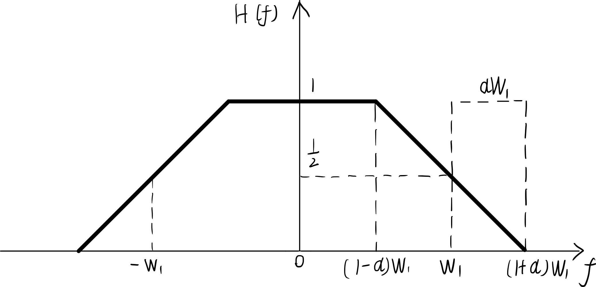

# 通信原理题目
## *1-6* 
**设英文字母 E 出现的概率为 0.105， X 出现的概率 0.002， 试求出 E 和 X 的信息量各为多少？**

$\because I=log_2\frac{1}{p(x)}$

$\therefore I_E=log_2\frac{1}{0.105}=3.252$, $I_X=log_2\frac{1}{0.002}=8.966$


## *1-7* 
**设某信源的符号集由 A、B、C、D、E、F 组成，设每个符号独立出现，其概率分别为 1/4、1/4、1/16、1/8、1/16、1/4，试求出该信息源输出符号的平均信息量？**

$\because H(X)=\sum_{i=1}^np(x_i)log_2\frac{1}{p(x_i)}$

$\therefore \bar{I}=-\sum_{i=1}^np(x_i)log_2{p(x_i)}=\frac{1}{4}log_2\frac{1}{1/4}+\frac{1}{4}log_2\frac{1}{1/4}+\frac{1}{16}log_2\frac{1}{1/16}+\frac{1}{8}log_2\frac{1}{1/8}+\frac{1}{16}log_2\frac{1}{1/16}+\frac{1}{4}log_2\frac{1}{1/4}=\frac{19}{8}=2.375$


## *1-8* 
**设数字传输系统传送二进制信号，码元速率 $R_{B2}=2400 B$，试求该系统的信息速率$R_{b2}$？若该系统改为十六进制信号，码元速率不变，试求该系统的信息速率？**

$\because R_{b2}=R_{B2}log_2M$

$\therefore R_{b2}=2400\times log_22=2400 bit/s$，若系统改为为十六进制，码元速率$R_{B2}$不变则：$R_{b16}=R_{B2}log_2M=2400log_216=9600 bit/s$


## *1-9* 
**已知某数字传输系统传送八进制信号，信息速率为 $3600 bit/s$，试问码元速率为多少？**

$\because R_{b8}=R_{B8}log_28=3600 bit/s$

$\therefore R_{B8}=\frac{3600}{log_28}=1200 B$


## *1-10* 
**已知二进制信号的传输速率为 $4800 bit/s$,试问变换成四进制和八进制数字信号时的码元速率各为多少？**

$\because R_{b2}=R_{B2}log_22=4800 bit/s$
, 且码元速率不变

$\therefore R_{B2}=4800 B, R_{B4}=R_{B2}log_24=9600 bit/s$

同理得，$R_{B8}=R_{B2}log_28=14400 bit/s$


## *1-11* 
**已知二进制信号的传输速率为 $4800 B$ ，如果保持信息速率不变，试问变换成四进制和八进制数字信号时的码元速率各为多少？**

$\because R_{b2}=R_{B2}log_22=4800 bit/s$

$\therefore R_{b4}=R_{B4}log_24= 4800 bit/s, R_{B4}=2400 B$

同理， $R_{B8}=\frac{R_{b8}}{log_28}=1600 B$

## *1-12* 
**已知某系统码元速率为 $3600 kB$, 接收端在 1h 内共收到 296 个错误码元，试求系统的误码率 $P_e$？**

$\because P_e=\frac{N_e}{N}$, 其中 $N_e$ 为错误码元数， $N$ 为总码元数

$\therefore P_e=\frac{296}{3600\times 1000\times 3600}=2.28\times 10^{-8}$


## *1-13* 
**已知某四进制数字信号传输系统的信息速率为 $2400 bit/s$， 接收端在 0.5h 内共收到 216 个错误码元，试计算该系统的误码率 $P_e$？**

$\because R_{b4}=2400 bit/s, P_e=\frac{N_e}{N}$

$\therefore R_{B4}=\frac{R_{b4}}{log_24}=1200 B, P_e=\frac{216}{1200\times 3600\times 0.5}=1.00\times 10^{-4}$ 


## *1-14* 
**在强干扰环境下，某电台在 $5 min$ 内共接收到正确信息量为 $355 Mbit$，假定系统信息速率为 $1200 kbit/s$。**

*1. 试求该系统的误信率 $P_b$？*
   
$P_b=\frac{N_e}{N}=\frac{1200\times 5\times 60\times 10^3-355\times 10^6}{1200\times 5\times 60\times 10^3}=1-\frac{355\times 10^6}{1200\times 5\times 60\times 10^3}=\frac{1}{72}=1.38\times 10^{-2}$

*2. 若具体指出系统所传数字信号为四进制信号，则 $P_b$ 为多少？其值是否改变？为什么？*

$P_{b_{Qua}}=P_b=\frac{1}{72}=1.38\times 10^{-2}$

该值不变，因为 $P_b$ 与码元速率无关，只与码元数有关，而码元数不变，所以 $P_b$ 不变。

*3. 若假定信号为四进制信号，系统传输速率为 $1200 kB$，则 $P_b$ 为多少？*

$P_b=1-\frac{355\times 10^6}{1200\times log_24\times 1000\times 5\times 60}=\frac{73}{144}=5.07\times 10^{-1}$


## *1-15* 
**某系统经长期测定，其误码率 $P_e=1.0\times 10^{-5}$，系统码元速率为 $1200 B$,试问在多长时间内可以收到 360 个错误码元？**

$\because P_e=\frac{N_e}{N}$, 其中 $N_e$ 为错误码元数， $N$ 为总码元数

$\therefore N_e=P_e\times N=1.0\times 10^{-5}\times 1200\times t=360$

$\Longrightarrow t=\frac{360}{1.0\times 10^{-5}\times 1200}=3.0\times 10^4 s=50 h$


## *3-4* 
**设达到相干解调器输入端的双边带信号为 $acos\omega_m tcos\omega_c t$。已知 $f_m=2 kHz$，信道噪声是窄带高斯白噪声，它的单边功率谱密度 $n_0=2\times 10^{-8} W/Hz$。若保障解调器输出信噪比应为 $20 dB$，试计算载波幅值 $a$ 应为多少？**

$\because SNR=(\frac{S_o}{N_o})_{DSB}=20 dB, \quad N_o=\frac{1}{2}n_0f_m, \quad S_o=\frac{1}{4}\overline{m^2(t)}$

$\therefore S_o=SNR\times N_o=20 dB\times 2.0\times 10^{-5} W$，其中 $Y dB=10lg{X}$

$\therefore 20 dB= 100\Longrightarrow S_o=2.0\times 10^{-3} W，\quad \overline{m^2(t)}=8.0\times 10^{-3} W \Longrightarrow a=\sqrt{2\cdot\overline{m^2(t)}}=\frac{\sqrt{10}}{25}=1.265\times 10^{-1}$


## *3-5* 
**已知调制信号为 $m(t)=4cos6000\pi t$，载频信号为 $c(t)=5cos2\pi 10^{6}t$**

*1. 写出 DSB 和 AM 已调信号的数学表达式；*

$S_{DSB}(t)=m(t)c(t)=4cos2\pi 10^{6}t\times cos6000\pi t$

$S_{AM}(t)=[A_0+m(t)]c(t)=(5+4cos6000\pi t)cos2\pi 10^{6}t, \quad A_0=c(t)_{max}=5 \ge m(t)_{max}$

*2. 计算 DSB 和 AM 已调信号的功率和调制效率；*

$P_{DSB}= P_f=\frac{1}{2}\overline{m^2(t)}=\frac{1}{4}{A_{m}}^2=4 W$， 调制效率为$\eta=\frac{P_f}{P_{DSB}}=100\%$

$P_{AM}=P_c+P_f=\frac{1}{2}\overline{m^2(t)}+\frac{1}{2}{A_{0}}^2=4+12.5=16.5W$， 调制效率为$\eta=\frac{P_f}{P_{AM}}=\frac{4}{16.5}=24.2\%$

*3. 求出 DSB 和 AM 已调信号的频谱；*

$\because\mathscr{F}[s_{DSB}(t)]=\frac{1}{2}[M(\omega+\omega_c)+M(\omega-\omega_c)]$

$\mathscr{F}[s_{AM}(t)]=\frac{1}{2}[M(\omega+\omega_c)+M(\omega-\omega_c)]+\pi A_0 [\delta(\omega+\omega_c)+\delta(\omega-\omega_c)]$

$\therefore S_{DSB}(w)=\frac{1}{2}[M(\omega+2\pi 10^6)+M(\omega-2\pi 10^6)]$

$S_{AM}(w)=\frac{1}{2}[M(\omega+2\pi 10^6)+M(\omega-2\pi 10^6)]+5\pi [\delta(\omega+2\pi 10^6)+\delta(\omega-2\pi 10^6)]$

*4. 求出 DSB 和 AM 已调信号的频带宽度；*

$B_{DSB}=2f_m=2\times \frac{6000\pi}{2\pi}=6 kHz$

$B_{AM}=2(f_c+f_m)-2(f_c-f_m)=2f_m=6 kHz$

*5. 说明 DSB 信号为什么不能用包络检波法接收；*

DSB 信号只能用相干解调法，这是因为包络检波法取出的信号包络始终为正值，而当调制信号 $m(t)$ 为负值时，取出的信号包络是其镜像，从而出现失真,不能正确解调。


## *3-7* 
**若频率为 $10 kHz$、振幅为 $1V$ 的正弦调制信号，以频率为 $100 MHz$ 的载频进行调制，已调信号最大频偏为 $1 MHz$ 求：**

*1. 调频波的近似带宽；*
$B_{FM}=2(\Delta f+f_m)=2(1000+10)=2.02 MHz$

*2. 若调制信号的振幅加倍，此时的调频波带宽；*

$\because m_f=\frac{k_fA_m}{\omega_m}$，振幅加倍则调频系数 $m_f$ 加倍

$\therefore \Delta f'=2\Delta f\Longrightarrow B_{FM}=4\Delta f+2f_m=4.02 MHz$

*3. 若调制信号的频率也加倍，此时的调频波带宽；*

$\because \Delta f'=2\Delta f, f_m'=2f_m$

$\therefore B_{FM}‘=4(\Delta f+f_m)=2.02\times2=4.04 MHz$

## *3-10* 
**设在 $1\Omega$ 的负载电阻上，有一角度调制信号，其表达式为 $s(t)=10cos(10^8\pi t+3sin2\pi \cdot 10^3t)\quad V$，试求：**

*1. 该信号的平均功率；*

$P=\overline{s^2(t)}=\frac{{A_0}^2}{2}=50 W$

*2. 该信号的最大频偏 $\Delta f$；*

$\Delta f=m_ff_m=3\times 10^3=3 kHz$

*3. 信号的频带宽度；*

$B=2(\Delta f+f_m)=2(3+1)=8 kHz$

*4. 信号的最大相位偏移量；*

$\Delta \varphi_m=m_p=3rad$

*5. 此信号是调频波还是调相波？为什么？*

若不给出具体的调制信号，无法判断。

调相波的调制信号为：
$m(t)=A_msin2\pi \cdot 10^3t$

调频波的调制信号为：
$m(t)=A_mcos2\pi \cdot 10^3t$


## *3-20* 
**某线性调制系统解调器输出端的输出信噪比为 $20 dB$；输出噪声功率为 $1.0\times 10^{-9} W$，发射机输出端到解调器输入端之前的总传输衰减为 $100 dB$，试问：**

*1. DSB 时的发射机输出功率；*

$\because \frac{S_o}{N_o}=20 dB=100, N_o=\frac{1}{4}N_i$

$\therefore\frac{S_i}{N_i}=\frac{1}{2}{\frac{S_o}{N_o}}=50,N_i=4.0\times10^{-9}W,S_i=50N_i=2.0\times10^{-7}W$

$\therefore S_{T_{DSB}}=-G_{传输}S_i=10^{10}\times S_i=2000 W$

*2. SSB 时的发射机输出功率；*

$\because \frac{S_o}{N_o}=20 dB=100, N_o=\frac{1}{4}N_i$

$\therefore\frac{S_i}{N_i}={\frac{S_o}{N_o}}=100,N_i=4\times10^{-9}W,S_i=100N_i=4.0\times10^{-7}W$

$\therefore S_{T_{DSB}}=-G_{传输}S_i=10^{10}\times S_i=4000 W$

*3. AM（100%调制度）时的调制信号功率；*

$\because S_i=\frac{1}{2}A_0^2+\frac{1}{2}\overline{m^2(t)},\overline{m^2(t)}=\frac{1}{2}A_0^2$

$\therefore S_i=\frac{3}{4}A_0^2$ 

$\because S_0=\frac{1}{4}\overline{m^2(t)}=\frac{1}{8}A_0^2$

$\therefore \frac{S_i}{S_0}=6$

$\because \frac{S_o}{N_o}=20 dB=100$

$\therefore S_0=100N_0,S_i=6S_0=600N_0=6\times10^{-7}W$

$S_{T_{DSB}}=-G_{传输}S_i=10^{10}\times S_i=6000 W$


## *4-2* 
**设二进制符号序列为 `110010001110`，试以矩形脉冲为例，分别画出相应的单极性码、双极性码、单极性归零码、双极性归零码、二进制差分码。**

```wavedrom
{signal: [
 { name: "bus",  wave: "x=.=.=.=.=.=.=.=.=.=.=.=.", data: [1,1,0,0,1,0,0,0,1,1,1,0]},
  { name:"单极性NRZ",	wave:'z1...z...1.z.....1.....z.'},
  { name:"双极性NRZ", wave:'01...0...1.0.....1.....0.'},
  { name:"单极性RZ",  wave:'z1z1zz...1z......1z1z1z..'},
  { name:"双极性RZ",  wave:'z1z1z0z0z1z0z0z0z1z1z1z0z'},
  { name:"二进制差分码",  wave:'01.0.....1.......0.1.0...'}
],
}
```
> 截至2023年，Wavedrom 尚未支持三极性波形，故用 `z` 来临时代替 `0`。

## *4-3* 
**已知信息代码为 `100000000011`，求相应的 AMI 码和 HDB3 码。**

```wavedrom
{signal: [
 { name: "bus",  wave: "x=.=.=.=.=.=.=.=.=.=.=.=.", data: [1,0,0,0,0,0,0,0,0,0,1,1]},
  { name:"AMI",	wave:'z1.z.................0.1.'},
  { name:"HDB3", wave:'z1.z.....1.0.z...0.z.1.0.'}
 ],
}
```

## *4-11* 
**已知基带传输系统总特性为如题图 4.2 所示的直线滚降特性。**


*1. 求冲激响应 $h(t)$；*

$h(t)=2W_1Sa(2\pi W_1t)Sa(2\pi aW_1t)$

*2. 当传输速率为 $2W_1$ 时，在抽样点有无码间串扰？*

$f_b=2W_1$，码元间隔$T_b=\frac{1}{f_b}=\frac{1}{2W_1}$

抽样值为 $h(kT_b)=2W_1Sa(2\pi W_1 kTb)Sa(2\pi aW_1kT_b)$
当 $k=0$ 时，$h(kT_b)=2W_1$
当 $k\ne 0$时，$h(kT_b)=2W_1Sa(k\pi )Sa(a\pi )=0$
因此，在 $f_b=2W_1$ 时，满足无码间串扰条件，抽样点无码间串扰。

*3. 与理想低通特性比较，由码元定时误差所引起的码间串扰是增大还是减小？*

当 $f_b=2W_1$ 时，理想低通特性的冲激响应：

$k(T)=Sa(2\pi W_1t)$

直线滚降的冲激响应为

$h(t)=2W_1Sa(2\pi W_1 t)Sa(2\pi aW_1t)$
其中 $Sa(2\pi aW_1t) < 1$
导致冲激响应的幅度减小一些，因此，由码元定时误差所引起的码间串扰减小了。

## *6-6*
**什么叫做量化和量化噪声？为什么要进行量化**

*量化*：用有限个电平来表示模拟信号抽样值被称为量化；
*原因*：量化把时间上离散但幅度上连续的信号变成时间和幅度都离散的信号，也就是多进制数字信号。


## *7-2*

**在 DSB 系统中，发送端方框图采用题图 7.1 所示的插入导频法，即载波 $Asin\omega_ct$ 不经过 $ -90^{\circ}$ 相移,直接与已调信号相加后输出，试证明接收端用相干接受法解调 DSB 信号时，解调器输出中含有直流成分**


由题意可知：
$u_0(t)=x'(t)Asin\omega_ct+Asin\omega_ct$
将 $u_0(t)$ 用相干解调器解调，得：
$V(t)=u_0(t)sin\omega_ct=A(1+x'(t))sin^2\omega_ct=\frac{1}{2}A(1+x'(t))[1-cos2\omega_ct]$
经低通滤波器输出：
$V_o(t)=\frac{1}{2}A(1+x'(t))$
可见，解调器输出中含有直流成分 $\frac{1}{2}A$。


## *7-6*
**画出用科斯塔斯环法（同相正交环法）实现载波同步的方框图，并简单说明其工作原理与优缺点。**



图中信号 $m(t)cos\omega_ct$ 分成两路，分别与压控振荡器输出 $v_1(t)$ 和 $v_2(t)$ 相乘，得到两路信号 $v_3(t)=m(t)cos\omega_ctcos(\omega_ct+\theta)$ 和 $v_4(t)=m(t)cos\omega_ctsin(\omega_ct+\theta)$。

经过低通滤波器 LPF 输出后，得到 $v_5(t)=\frac{1}{2}m(t)cos\theta$ 和 $v_6(t)=\frac{1}{2}m(t)sin\theta$。
将两信号加到相乘器中，输出为 $v_7(t)=\frac{1}{4}m^2(t)[cos^2\theta+sin^2\theta]=\frac{1}{4}m^2(t)sin\theta cos\theta \approx\frac{1}{4}m^2(t)\theta$。

此信号经过环路滤波器后，控制压控振荡器使其与 $f_c$ 同频，相位差仅仅为 $\theta$，此时压控振荡器输出为 $v_1(t)=cos(\omega_ct+\theta)$,正好是需要提取的同步载波信号，在上一路的 LPF 输出正好可以作为 DSB 信号解调器的输出。

科斯塔斯环法的优点是：精度搞、性能好，可以直接解调出信号 $m(t)$；但其硬件电路比较复杂，同时存在相位含糊问题（当相位为180时）。

## *8-3*

**汉明码有哪些特点**

汉明码是一种能够纠正单个错码且编码效率较高的线性分组码，有以下特点：
1. 最小码距 $d_0=3$，可以纠正单个错码；
2. 码长 $n$ 与监督码元 $r$ 间满足关系式 $n=2^r-1$，编码效率较高；


## *8-21*

**已知 8 个线性分组为 000000、001110、010101、011011、100011、101101、110110、111000，试求其最小码距 $d_{min}$。若用于检错，能检测出几位错码？若用于纠错，能纠正几位误码？若同时用于检错、纠错，各能检测、纠正几位误码?**

$\because d_{min}=min\left \{\sum_{j=1}^8 (a_{kj}\oplus a_{mj}) \right \}$

$\therefore d_{min}=min \left \{3,4,3,3,3,4,3 \right \}=3$

用于检错：
$\because d_0=3\ge e+1$
$\therefore e\le 2$，能检测出 2 位错码

用于纠错：
$\because d_0=3\ge 2t+1$
$\therefore t\le 1$，能纠正 1 位误码

同时用于检错、纠错：
$\because d_0=3\ge 2t+1, d_0\ge e+1=3 \Longrightarrow d_0=3\ge t+e+1$，且 $e\ge t$

$\therefore t\le 1, e\le 1$，能检测 1 位错码，纠正 1 位误码。


## *8-30*

**已知（7，4）循环码的生成多项式 $g(x)=x^3+x+1$**

*1. 求其生成矩阵及监督矩阵；*

$\because n=7,k=4,r=3,g(x)=x^3+x+1$

$\therefore \textbf{G}(x)=\begin{bmatrix}
x^3g(x)\\
x^2g(x)\\
xg(x)\\
g(x)
\end{bmatrix}=
\begin{bmatrix}
x^6+x^4+x^3\\
x^5+x^3+x^2\\
x^4+x^2+x\\
x^3+x+1
\end{bmatrix}$
$\textbf{G}=\begin{bmatrix}
1&0&1&1&0&0&0\\
0&1&0&1&1&0&0\\
0&0&1&0&1&1&0\\
0&0&0&1&0&1&1
\end{bmatrix}=\begin{bmatrix}
1&0&0&0&1&0&1\\
0&1&0&0&1&1&1\\
0&0&1&0&1&1&0\\
0&0&0&1&0&1&1
\end{bmatrix}$

$\because \textbf{G}=[I_k,P^T]$
$\therefore \textbf{H}=\begin{bmatrix}
1&1&1&0&1&0&0\\
0&1&1&1&0&1&0\\
1&1&0&1&0&0&1
\end{bmatrix}
$

*2. 写出系统循环码的全部码字；*

$\because g(x)=x^3+x+1$
$\therefore \begin{array}{l}
A_1(x)=x^3+x+1\\
A_2(x)=x^4+x^2+x\\
A_3(x)=x^5+x^3+x^2\\
A_4(x)=x^6+x^4+x^3\\
A_5(x)=x^5+x^4+1\\
A_6(x)=x^6+x^5+x\\
A_7(x)=x^6+x^2+1
\end{array}$

全部码字如下表：
| 序号 | 码字    |
| ---- | ------- |
| 0    | 0000000 |
| 1    | 0001011 |
| 2    | 0010110 |
| 3    | 0101100 |
| 4    | 1011000 |
| 5    | 0110001 |
| 6    | 1100010 |
| 7    | 1000101 |

*3. 画出编码电路，并列表说明编码过程；*

~~不会画，告辞~~

*4. 画出译码电路，并且列表说明译码过程。*

~~只求及格，不求满分，不做了~~